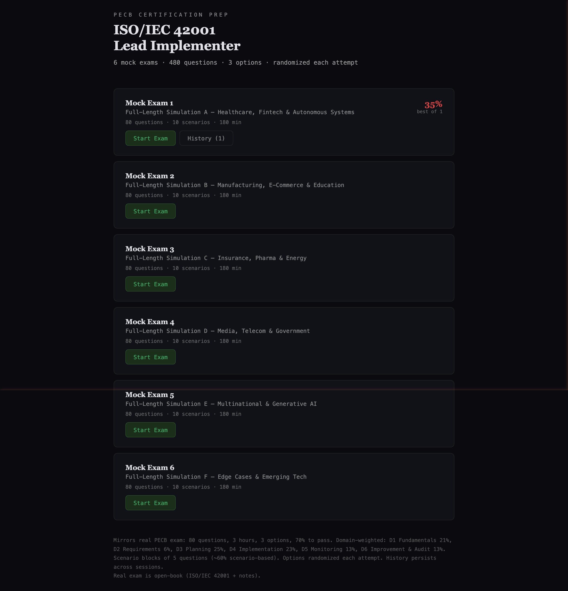
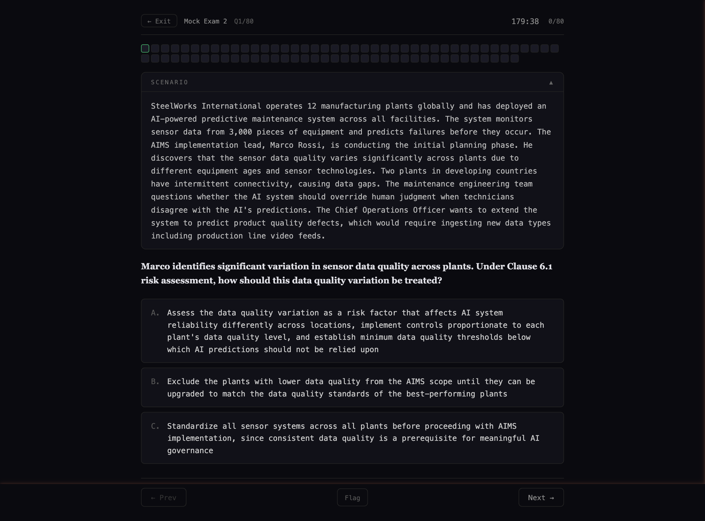
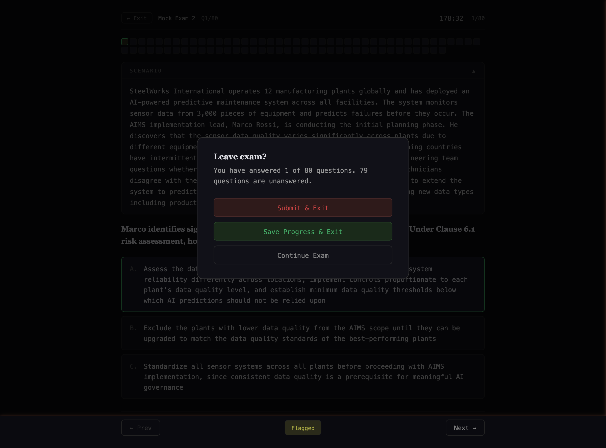

# ISO/IEC 42001 Lead Implementer Mock Exams

A comprehensive mock exam system for preparing for the **PECB ISO/IEC 42001 Lead Implementer** certification. Built with React, TypeScript, and a hexagonal architecture.

## Screenshots

### Home — Exam Selection


### Exam — Scenario-Based Questions


### Exit — Save Progress or Submit


## Features

**480 questions** across 6 full-length simulation exams, each mirroring the real PECB certification format:

- **80 questions per exam** (real exam: 80 questions)
- **3-hour timer** (real exam: 180 minutes)
- **3 options per question** with nuanced, plausible distractors
- **70% pass threshold** (real exam: 70%)
- **~60% scenario-based** with 5-question scenario blocks
- **Domain-weighted** matching real exam proportions:

| Domain | Topic | Weight | Questions |
|--------|-------|--------|-----------|
| D1 | Fundamental principles and concepts | 21.25% | 17 |
| D2 | AIMS requirements | 6.25% | 5 |
| D3 | Planning of AIMS implementation | 25% | 20 |
| D4 | Implementation of AIMS | 22.5% | 18 |
| D5 | Monitoring and measurement | 12.5% | 10 |
| D6 | Continual improvement & certification audit | 12.5% | 10 |

### Exam Practice Features

- **Option randomization** &mdash; Answer choices shuffle every attempt so you can't memorize positions
- **Question flagging** &mdash; Mark questions for later review during the exam
- **Save progress** &mdash; Exit mid-exam and resume later with all answers preserved
- **Review mode** &mdash; After submission, review every question with correct answer highlighted and detailed explanations
- **Attempt history** &mdash; All attempts persisted in IndexedDB across browser sessions with scores, time spent, and pass/fail status
- **Exit confirmation** &mdash; Modal with Submit & Exit, Save Progress & Exit, or Continue options

### Exam Topics

| Exam | Theme | Industries |
|------|-------|------------|
| Mock Exam 1 | Full-Length Simulation A | Healthcare, Fintech, Autonomous Systems |
| Mock Exam 2 | Full-Length Simulation B | Manufacturing, E-Commerce, Education |
| Mock Exam 3 | Full-Length Simulation C | Insurance, Pharma, Energy |
| Mock Exam 4 | Full-Length Simulation D | Media, Telecom, Government |
| Mock Exam 5 | Full-Length Simulation E | Multinational, Generative AI |
| Mock Exam 6 | Full-Length Simulation F | Edge Cases, Emerging Tech |

## Quick Start

```bash
npm install
npm run dev
```

Open `http://localhost:5173` in your browser.

## Architecture

The project follows **hexagonal architecture** (ports & adapters) for clean separation of concerns:

```
src/
├── domain/                          # Core business logic (no dependencies)
│   ├── models/
│   │   ├── Exam.ts                  # Exam, Question, Section types + shuffle logic
│   │   └── Attempt.ts              # Attempt entity + score calculation
│   └── ports/
│       ├── ExamRepository.ts        # Port: load exams
│       └── AttemptRepository.ts     # Port: save/load attempts
│
├── adapters/                        # Infrastructure implementations
│   ├── persistence/
│   │   ├── IndexedDBAttemptRepository.ts   # IndexedDB adapter (browser DB)
│   │   └── StaticExamRepository.ts        # In-memory exam data adapter
│   └── ui/                          # React UI adapter
│       ├── App.tsx                  # Root component, wires ports to adapters
│       ├── pages/                   # HomePage, ExamPage, ResultsPage, etc.
│       ├── components/              # QuestionCard, Timer, NavDots, etc.
│       └── hooks/                   # useExam, useAttempts
│
├── data/
│   ├── exams.ts                     # Barrel file importing all exams
│   └── exam[1-6].ts                 # Individual exam data files
│
└── main.tsx                         # Entry point, creates adapters
```

### Why Hexagonal?

- **Domain logic is pure** &mdash; `Exam.ts` and `Attempt.ts` have zero framework dependencies
- **Persistence is swappable** &mdash; Replace IndexedDB with localStorage, a REST API, or a database by implementing the port interface
- **UI is an adapter** &mdash; React components consume domain models through ports, not direct data access

## Tech Stack

- **Vite** &mdash; Fast dev server and build
- **React 18** &mdash; UI framework
- **TypeScript** &mdash; Type safety throughout
- **IndexedDB** (via `idb`) &mdash; Client-side database for persistent attempt history
- **localStorage** &mdash; Save/resume in-progress exams

## How It Compares to the Real Exam

| Feature | Real PECB Exam | This App |
|---------|---------------|----------|
| Questions | 80 | 80 per exam |
| Time | 180 minutes | 180 minutes |
| Options | 3 (A, B, C) | 3 (randomized) |
| Pass mark | 70% | 70% |
| Scenario blocks | 5 questions each | 5 questions each |
| Open-book | Yes (ISO 42001 + notes) | No (memory-based) |
| Domains | All 6 per exam | All 6, weighted |

> **Note:** The real exam is open-book. You may bring a hard copy of ISO/IEC 42001 and your training notes. This app tests without references, making it a harder practice environment.

## Content Sources

Questions are based on:

- **ISO/IEC 42001:2023** &mdash; AI management system requirements (Clauses 4-10, Annexes A-D)
- **ISO/IEC 17021-1:2015** &mdash; Certification body requirements and audit process
- **ISO/IEC 22989** &mdash; AI terminology and concepts
- **ISO/IEC 23894** &mdash; AI risk management guidance
- **ISO/IEC 38507** &mdash; AI governance for governing bodies
- **ISO/IEC TR 24028** &mdash; Trustworthiness in AI systems
- **ISO/IEC 23053** &mdash; AI and ML framework
- **EU AI Act** &mdash; Risk classification, high-risk requirements, regulatory sandboxes
- **NIST AI RMF** &mdash; Govern, Map, Measure, Manage framework
- **PECB ISO/IEC 42001 Lead Implementer training material**

## License

For personal study use only. Exam questions are original content created for certification preparation.
